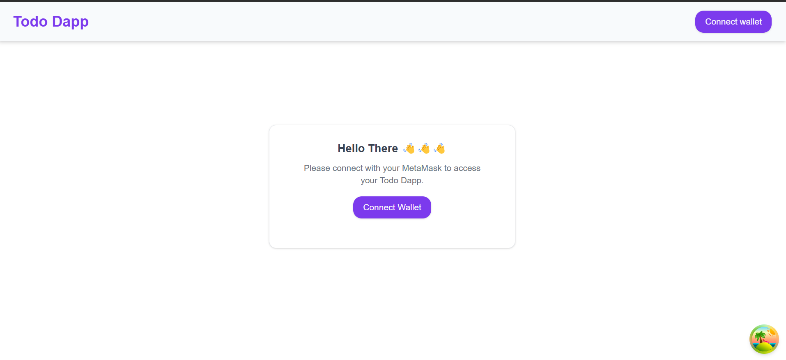

<div style="display: flex; justify-content: space-between; align-items: center; border: 2px solid #ccc; padding: 10px; border-radius: 10px;">
  <span style="font-weight: bold; font-size: 1.4rem;">Chromia Todo-List Dapp powered by Chromia</span>
  
</div>

## Author Information

**Author**: Yonas Awoke Yitay

**Email**: [yonasawokeyitay@gmail.com](mailto:yonasawokeyitay@gmail.com) || [bdu1405437@bdu.edu.et](mailto:bdu1405437@bdu.edu.et)

**Telegram**: [@YonanYonani](https://t.me/YourTelegramUsername)**University**: Bahir Dar University

> ###### _**"I prefer a clean code than a just working code"**_

## Project description

This project is a multi-user todo-list decentralised application developed using **Chromia**, **Rell**, and the **FT4 library**. It allows users to manage their tasks effectively by providing features for adding, updating, completing, and deleting tasks. Each user can only view and manage their own tasks, ensuring privacy and security.

## How It Works

1. **User Authentication**:

   - Users log in securely by connecting an **EVM-compatible wallet** like MetaMask.
   - Tasks are securely associated with the authenticated user's account.

2. **Task Management**:

   - Users can create tasks by providing a title, description, and due date.
   - Tasks can be updated, completed, deleted, or filtered by status (completed/pending) and sorted by due date.
   - Tasks not completed by their due date are automatically transitioned to the **OVERDUE** state by the blockchain.

3. **Real-Time Performance**:

   - Using **React Query**, the app provides efficient data fetching, caching, and synchronization, ensuring real-time updates across the UI.

4. **User-Friendly Interface**:

   - A simple UI lets users manage tasks with minimal effort, view real-time task status, and toggle between completed and incomplete states.

## Prerequisites

Before you begin, make sure you have the following installed:

- **Node.js** minne is v23.5.0
- **pnpm** mine is 9.15.2
- **TypeScript** (TypeScript is required for the application setup)

You can check if you have Node.js and pnpm installed by running the following commands:

```bash
node -v
pnpm -v
```

## Setup Instructions

To run this project locally, follow these steps:

### **Clone the repository:**

```bash
git clone https://github.com/YonaniCodes/todo-dapp.git
the change direrectory to the cloned repo
```

### **BlockChain Setup Guide**

```
cd backend
chr install
chr node start
// Copy the BlockChaib rid from the log or run the following cmd

//if you are interested you can run some unit tests of basic functionalties
 chr test
```

### **Front-End Setup Guide**

```cd
 cd frontend
```

open the .env file set the values

```
NEXT_PUBLIC_NODE_URL_POOL=http://localhost:7740
NEXT_PUBLIC_BLOCKCHAIN_RID=`<your blochain rid/>

```

Install the dependencies

```
pnpm i
pnpm dev

```

Open the http://localhost:3000/

Thanks Incase you found any dependency problem please reach out to me!

## Usage Instructions

You can see [Watch the Demo on Loom](https://www.loom.com/share/08f585a6459742f3b8f96f924fe69783) or follow the instuction below, I suggest the demo.

- Connect to metamask wallet using google chrome browser

  

- After succesful login a dialogu box will pop up which gives you 5 task for getting started


- You can perform CRUD operations, filter tasks, and sort them. By default:

* **Filter**: None (fetch all data)
* **Sorting**: Due date (ascending)

- To edit or delete a task, hover over the task, and the action buttons will appear.
- To add a task, use the floating button at the bottom left.
- To complet or uncomplet task just click the check box


## Additional Notes

1. Make sure when you create tasks to the date is at least 30 sec a head.
2. Nothing occurs when you attempt to create a new task whose date has passed, indicating that the work will not be generated. Please refer to my backend implementation for further details.
3. Additionally, once a work is past due according to the block chain, the user is not permitted to change its status. **A task cannot be overdue by the user; instead, the blockchain will mark it as such if it is not finished by the deadline.**
4. The only way to obtain tasks is through a single, dynamic API that can filter, sort, and return all of the tasks. This means that the clients can retrieve all of the tasks and filter them, but I use blockchain-side filtering and sorting even though I can do it in the front end.
5. My custom hooks are perfect for the user experience since they can cache tasks rather than triggering a request each time the filter is modified.
