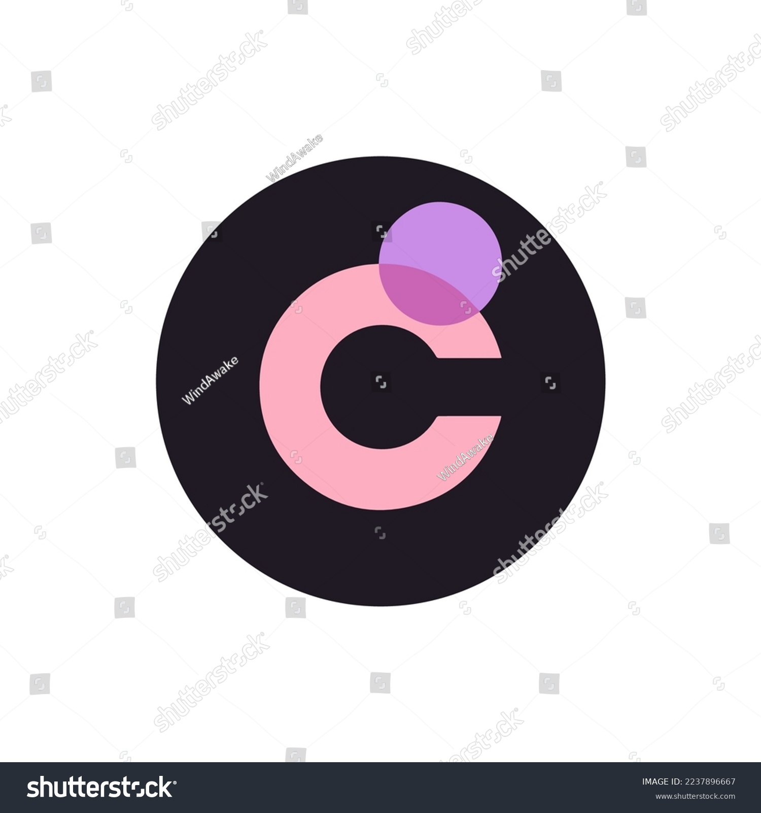

<div style="display: flex; justify-content: space-between; align-items: center; border: 2px solid #ccc; padding: 10px; border-radius: 10px;">
  <span style="font-weight: bold; font-size: 1.4rem;">Chromia Todo-List DApp powered by Chromia</span>
  
</div>

## Author Information

**Author**: Yonas Awoke Yitay**Email**: [yonasawokeyitay@gmail.com](mailto:yonasawokeyitay@gmail.com) || [bdu1405437@bdu.edu.et](mailto:bdu1405437@bdu.edu.et)**Telegram**: [@YonanYonani](https://t.me/YourTelegramUsername)**University**: Bahir Dar University

> _"I prefer a clean code than a just working code"_

## Project description

This project is a multi-user todo-list decentralised application developed using **Chromia**, **Rell**, and the **FT4 library**. It allows users to manage their tasks effectively by providing features for adding, updating, completing, and deleting tasks. Each user can only view and manage their own tasks, ensuring privacy and security.

## How It Works

1. **User Authentication**:

   - Users log in securely by connecting an **EVM-compatible wallet** like MetaMask.
   - Tasks are securely associated with the authenticated user's account.

2. **Task Management**:

   - Users can create tasks by providing a title, description, and due date.
   - Tasks can be updated, completed, deleted, or filtered by status (completed/pending) and sorted by due date.
   - Tasks not completed by their due date are automatically transitioned to the **OVERDUE** state by the blockchain.

3. **Real-Time Performance**:

   - Using **React Query**, the app provides efficient data fetching, caching, and synchronization, ensuring real-time updates across the UI.

4. **User-Friendly Interface**:

   - A simple UI lets users manage tasks with minimal effort, view real-time task status, and toggle between completed and incomplete states.

## Prerequisites

Before you begin, make sure you have the following installed:

- **Node.js** minne is v23.5.0
- **pnpm** mine is 9.15.2
- **TypeScript** (TypeScript is required for the application setup)

You can check if you have Node.js and pnpm installed by running the following commands:

```bash
node -v
pnpm -v
```

## Setup Instructions

To run this project locally, follow these steps:

### **Clone the repository:**

```bash
git clone https://github.com/username/repository-name.git
```

### **BlockChain Setup Guide**

```
cd blockchain
chr install
chr install
// Copy the BlockChaib rid from the log
```

### **Front-End Setup Guide**

```cd
 cd frontend
```

open the .env file set the values

```.env
NEXT_PUBLIC_NODE_URL_POOL=http://localhost:7740
NEXT_PUBLIC_BLOCKCHAIN_RID=<your blochaib rid/>

```

Install the dependencies

```
pnpm i
pnpm dev

```

Open the http://localhost:3000/

Thanks Incase you fac any depeendency problem please reachout to me!

## Usage Instructions

When you open the landing page, MetaMask will prompt you to connect your wallet. After creating an account, a dialog box will guide you through the next steps.


You can perform CRUD operations, filter tasks, and sort them. By default:

- **Filter**: None
- **Sorting**: Due date (ascending)


_Please are going to be execulted If the date is in the past nothing happen if you try to do for more please see my backe end implmentation_

## Additional Notes

- If you encounter any dependency issues, feel free to reach out to me via the provided contact information.
